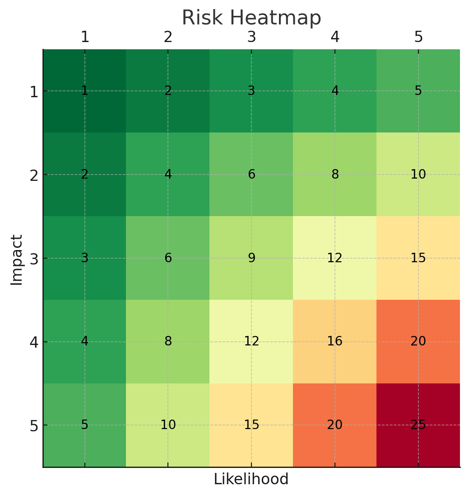

# 🛡️ NIST CSF-Aligned Risk Register Project

This project demonstrates the creation of a Governance, Risk, and Compliance (GRC) risk register using the **NIST Cybersecurity Framework (CSF)** as a guiding standard. It includes a 10-risk register, visual heatmap, and comprehensive report—all built as part of a hands-on GRC learning lab.

---

## 📌 Objectives

- Identify and document cybersecurity risks aligned to NIST CSF
- Assign likelihood, impact, and calculate risk scores
- Define risk owners and mitigation controls
- Visualize risks using a heatmap
- Generate a professional PDF report

---

## 📊 Project Files

| File | Description |
|------|-------------|
| `NIST_CSF_Risk_Register.xlsx` | Raw risk register with 10 risks |
| `Risk_Register_with_Heatmap.xlsx` | Includes conditional formatting heatmap |
| `risk_heatmap.png` | Visual risk heatmap (Impact × Likelihood) |
| `NIST_CSF_Risk_Register_Report.pdf` | Complete report with register + heatmap |

---

## 🧩 Sample Risk Entry

| Risk ID | Description                            | CSF Category                          | Likelihood | Impact | Score | Owner       |
|---------|----------------------------------------|----------------------------------------|------------|--------|-------|-------------|
| R-01    | Insecure remote access configuration   | Protect - Access Control (PR.AC)       | 4          | 5      | 20    | IT Manager  |

---

## 📈 Risk Heatmap

---

## 🏗️ Built With

- Excel for risk tracking and dashboard
- NIST Cybersecurity Framework (CSF)

---

## 🧠 Skills Demonstrated

- Risk assessment and scoring
- NIST CSF control mapping
- Compliance documentation
- Dashboard design and data visualization
- Report writing

---
